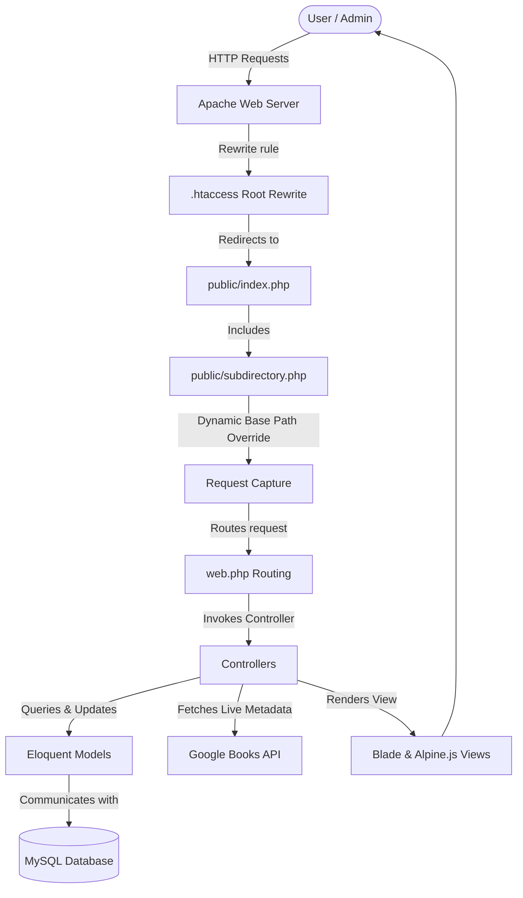

# Premium Online Book Store 📚

A modern, full-featured Laravel-based Online Book Store application. The system enables users to browse, search, and filter a curated book catalog, view live metadata retrieved from the Google Books API, and place orders. It also features a secure administrative dashboard for managing inventory, handling client orders, and importing books from Google Books with one click.

---

## ⚙️ System Architecture: How It Works

This application follows the MVC (Model-View-Controller) architecture pattern using Laravel 9, powered by a relational MySQL database and running purely on a PHP + Apache environment.



### 1. Request Flow & Subfolder Routing
To support smooth running inside subdirectories (like XAMPP's `/Online_Book_Store/`), a root [.htaccess](file:///d:/xampp/htdocs/Online_Book_Store/.htaccess) intercepts all traffic and transparently redirects it to the `public/` directory:
```apache
<IfModule mod_rewrite.c>
    RewriteEngine On
    
    # If the request is for the root folder itself, rewrite to public/index.php
    RewriteRule ^$ public/index.php [L]
    
    # Rewrite all other requests to the public directory if they don't already contain /public/
    RewriteCond %{REQUEST_URI} !/public/
    RewriteRule ^(.*)$ public/$1 [L,QSA]
</IfModule>
```
The application includes a helper [.subdirectory.php](file:///d:/xampp/htdocs/Online_Book_Store/public/subdirectory.php) loaded dynamically in `public/index.php`. This automatically detects the project folder name relative to Apache's `DOCUMENT_ROOT` and adjusts PHP's `SCRIPT_NAME` and `PHP_SELF` variables so routes match perfectly without requiring hardcoded configuration updates.

### 2. Core Functional Components
* **Storefront Catalog:** Provides real-time query searching (by title or author), category filters, and sorting parameters (alphabetical or price) built directly into Eloquent database queries.
* **Google Books API Integration:** Utilizes Laravel's HTTP Client (powered by Guzzle) to query the Google Books API. The book details page fetches real-time average ratings, page count, and publishers dynamically.
* **Order Management System:** Authenticated customers can checkout items, view order statuses, and update their shipping details while the order is `pending`. Admins can transition order statuses (e.g., `confirmed`), which instantly allows users to access and view print-ready order receipts.
* **Admin Inventory & CRUD:** Administrators have access to a dashboard to create, edit, delete, or import books directly from external Google Books search results.

---

## 🛠️ Required Downloads & Environment Setup

To run this application locally, you must install the following software suites on your developer machine:

| Software | Purpose | Minimum Version | Download Link |
| :--- | :--- | :--- | :--- |
| **XAMPP / WampServer** | Local Apache server & MySQL database suite | PHP 8.0+ | [Download XAMPP](https://www.apachefriends.org/index.html) |
| **Composer** | PHP dependency and package manager | 2.0+ | [Download Composer](https://getcomposer.org/) |
| **Git** | Codebase cloning and version control | Latest | [Download Git](https://git-scm.com/) |

*(Note: Node.js and NPM are completely optional and not required to compile assets or run this application. All frontend styles are delivered natively via CDN.)*

---

## 📦 Project Packages & Dependencies

### Backend Packages (Composer)
These are configured in [composer.json](file:///d:/xampp/htdocs/Online_Book_Store/composer.json):
* **`laravel/framework` (^9.19):** Core MVC structure, router, ORM (Eloquent), and template compiler.
* **`guzzlehttp/guzzle` (^7.2):** HTTP request handler used for interacting with the external Google Books API.
* **`laravel/sanctum` (^3.0):** Lightweight authentication guard system.
* **`laravel/tinker` (^2.7):** Command-line REPL shell interface to interact with database models.
* **`phpunit/phpunit` (^9.5):** Developer automated testing suite framework.

### Frontend CDN Assets
No compilation is required. Frontend UI relies on:
* **Tailwind CSS (via Play CDN):** Integrated directly in `app.blade.php` with custom extendable brand colors.
* **Alpine.js (via CDN):** Reactive JavaScript engine used for sidebar and dropdown toggling.
* **FontAwesome Icons (via CDN):** Renders responsive icons for navigation and dashboards.

---

## 🚀 Installation & Local Deployment Guide

Follow these sequential steps to deploy the project locally:

### 1. Clone & Position in Webroot
Clone the repository directly into your local server webroot directory (e.g., `C:\xampp\htdocs\Online_Book_Store` or `D:\xampp\htdocs\Online_Book_Store`).

### 2. Install Dependencies
Open your terminal inside the project root directory and run:
```bash
# Install PHP packages
composer install
```

### 3. Setup Environment variables
Copy the `.env.example` file to create a `.env` configuration:
```bash
copy .env.example .env
```
Ensure your database credentials and `APP_URL` are set correctly inside `.env`:
```env
APP_URL=http://localhost/Online_Book_Store

DB_CONNECTION=mysql
DB_HOST=127.0.0.1
DB_PORT=3306
DB_DATABASE=online_book_store
DB_USERNAME=root
DB_PASSWORD=
```

### 4. Database Seeding & Setup
Create a database named `online_book_store` in phpMyAdmin or MySQL, then run the migrations and database seeders:
```bash
php artisan migrate:fresh --seed
```
This command will create all database tables and populate the system with pre-configured developer accounts and catalog books.

#### 🔑 Seeder Accounts
* **Customer Account:**
  * **Email:** `user@bookstore.com`
  * **Password:** `user123`
* **Administrator Account:**
  * **Email:** `admin@bookstore.com`
  * **Password:** `admin123`

### 5. Running the Application
Simply start Apache and MySQL from your XAMPP Control Panel. The application will immediately be accessible in your web browser at:
`http://localhost/Online_Book_Store/`

---

## 🧪 Developer Testing Guide

### 1. Running Automated Feature Tests
The project features a comprehensive automated testing suite located in [BookStoreTest.php](file:///d:/xampp/htdocs/Online_Book_Store/tests/Feature/BookStoreTest.php). 

To ensure developer testing does not alter your local development database, the configuration in [phpunit.xml](file:///d:/xampp/htdocs/Online_Book_Store/phpunit.xml) runs tests against an isolated **in-memory SQLite database** (`:memory:`).

To execute the tests, run:
```bash
vendor/bin/phpunit
```
*(If PHP is not globally registered in your path, use the absolute PHP execution path, e.g., `d:\xampp\php\php.exe vendor/phpunit/phpunit/phpunit`)*

### 2. Manual Inspection & Verification Checklist
Ensure the following behaviors work correctly in your local browser environment:
1. **Public Catalog (`/books`):** Verify keyword search, filtering by categories, and sorting.
2. **Details Page (`/books/{id}`):** Check that the Google Books API fallback details (ratings, pages, publisher) display correctly.
3. **Checkout Flow:** Log in as a customer (`user@bookstore.com`), checkout a book, and check the dashboard order listing.
4. **Order modification:** Verify that customers can edit their address/shipping details as long as the status is `Pending Confirmation`.
5. **Admin Operations (`/admin/dashboard`):** Log in as an administrator (`admin@bookstore.com`), and verify:
   * Adding new books manually or importing using the search explorer.
   * Modifying existing books.
   * Canceling / deleting client orders.
   * Approving/confirming client orders to generate printable receipts.
